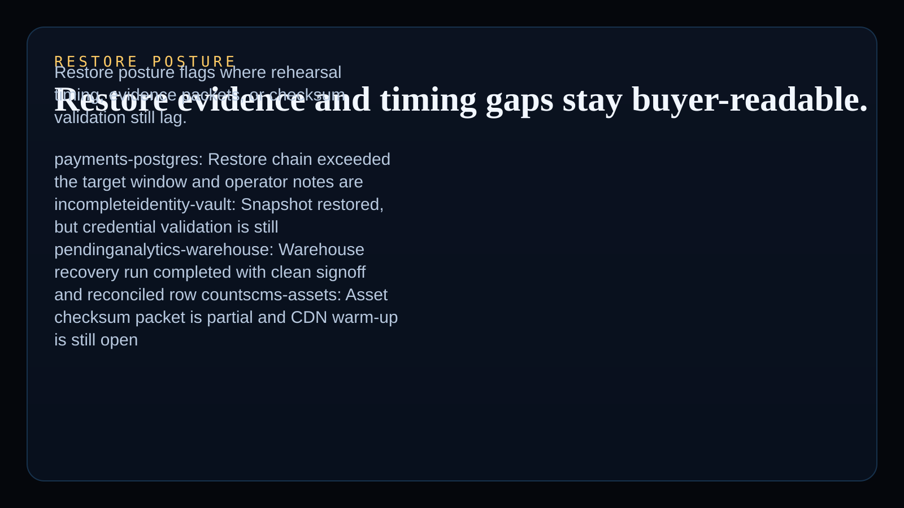

# backup-restore-drill-runner

Bash-native operator surface for SRE, Platform, and infrastructure teams reviewing backup rehearsal timing, restore evidence completeness, recovery blockers, and next-step remediation posture.

## Product depth

- real `Shell / Bash` added to the public Kinetic Gain language atlas with a third distinct primitive
- backup and restore drill decisioning that comes from shell analysis, not a mocked dashboard
- monetizable runbook kits, recovery templates, and embedded resilience consulting hooks
- executive-readable restore posture for leaders who need to know which systems can actually be recovered inside the promised window
- technical proof that the same shell runner can analyze drill inputs, publish static evidence routes, and package README proof assets without a separate dashboard dependency

## What these repos have in common

Kinetic Gain proof surfaces turn operational data into a repeatable decision layer: a clear risk signal, an accountable owner context, an evidence packet, and a next action. This one focuses on backup and restore resilience, but the pattern matches the broader suite: reduce vague status reporting, make control posture buyer-readable, and keep the public proof tied to working code.

## Operating workflow

1. Run the shell analysis against the synthetic drill register.
2. Generate the static site, sitemap, docs route, and README proof assets from the same source path.
3. Smoke-check every public route for product depth, common-pattern language, and portfolio interlinks.
4. Review the restore posture by system, target window, actual recovery time, blockers, and recommendation.

## Screenshots





## Routes

- `/`
- `/drill-lane/`
- `/recovery-matrix/`
- `/restore-posture/`
- `/verification/`
- `/docs/`

## Local development

```powershell
bash scripts/run_demo.sh
bash scripts/generate_site.sh
```

## Validation

```powershell
bash test/runtests.sh
bash scripts/smoke_check.sh
bash scripts/render_readme_assets.sh
```

## Safety note

This repo uses synthetic demonstration data only. It is framed as recovery-readiness evidence and does not claim audited disaster-recovery compliance or formal certification.

## Why this matters

Kinetic Gain Embedded tie-back:

This repo proves Kinetic Gain can ship buyer-readable backup and restore drill logic directly from Bash. The language-atlas signal is real: analyze recovery timing, publish operator routes, and keep the same surface usable for runbook kits and embedded resilience work.

## Commercial path

- `Paid runbook kit`
- `Consulting hook`

This can ladder into restore rehearsal packs, backup evidence checklists, resilience review decks, and embedded recovery-governance work for platform and infrastructure teams.

---

Part of the [Kinetic Gain operator portfolio](https://kineticgain.com/) · docs: [suite.kineticgain.com](https://suite.kineticgain.com/) · live: [backup.kineticgain.com](https://backup.kineticgain.com/)
